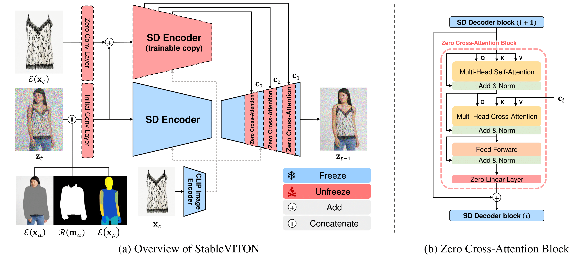

# _Study_StableViton
In this repo, I am trying to Deeply understand and analysis of [CVPR2024-StableVITON](https://arxiv.org/abs/2312.01725) (model &amp; paper). And find approaches to mimimalize its model size.

[[The main Project Page](https://rlawjdghek.github.io/StableVITON/)]&nbsp;

&nbsp;

## TODO List
- [ ] Solution Explanation
- [ ] Explain Paint-By-Example in DM (diffusion models) world
- [ ] Model understanding
- [ ] Sub Model Understanding
- [ ] Input to output flow throught model
- [ ] Model pretrained weights extraction from checkpoint 
- [ ] Model size and training specsf
- [ ] Training Section
- [ ] Special points mentioned in the Paper

## Solution Explanation 
StableVITON approaches the problem as an inpainting task, which is common in diffusion models and closely related to Paint-By-Example (PBE). The model replaces missing parts (e.g., masked areas) with realistic clothing fitting the pose of the person using a guided approach with agnostic images and densepose.


## Explain Paint-By-Example(PBE) in DM (diffusion models) world
Paint-By-Example (PBE) refers to using image inpainting techniques, where diffusion models generate or complete an image based on a specific masked region and an example image for guidance. In the Diffusion Model (DM) world, the process involves progressively denoising random noise to reconstruct the missing parts of an image, while ensuring that the missing region is filled according to the example provided. The goal is to maintain coherence with the original image’s context and the condition (example)
&nbsp;

## Acknowledge
The code of StableViton and PBE borrows heavily from Stable Diffusion. thanks to the contributors of OpenAI's ADM codebase and https://github.com/lucidrains/denoising-diffusion-pytorch.


## Model understanding
the model is consist of 
-  CLIP Image Encoder: Provides image embedding that capture semantic context fom the reference image.
-  UNET model: Used for the noise prediction during denoising steps.
-  ControlNet: Guides the generation with structured cues.
-  Variational autoencoder (VAE): (Encoder)Encodes the input image into a latent representation for dimensionality reduction and (decoder) decodes the latent space after denoising step to get high quality generation.
-  conditional Latent diffusion model wrapper (CLDM): Wrapper that units all modules together and hold the mechanics of the conditiona diffusion process. Generates the final output conditioned on the latent inputs.

## Sub Model Understanding

### CLIP Image Encoder
The CLIP (constructive Language Image Pre-training) is consistent of Image Encoder and Text Encoder. 
CLIP (Contrastive Language–Image Pretraining) is a neural network developed by OpenAI that combines text and image understanding. It consists of two main parts:
- Text Encoder: Converts textual descriptions into a latent space representation.
- Image Encoder: Converts images into the same latent space, allowing the model to align the representations of text and images. This enables CLIP to understand images and match them to relevant text or vice versa.

#### Image Encoder in CLIP
The Image Encoder is typically based on a Vision Transformer (ViT) or ResNet. It processes an image into a fixed-size embedding in the same latent space as the text representations. This allows the model to compare the image with its corresponding textual descriptions or attributes. The image encoder essentially captures semantic details, including object relationships, colors, textures, and overall context, making it useful for tasks like retrieval, captioning, and classification.

#### Utility in StableVITON
In StableVITON, the image encoder plays a crucial role in understanding the clothing details and the overall image context. It captures high-level semantic information (like shape, color, and texture) from reference images of clothes or human figures. These image embeddings are used as <ins>hints</ins> in the diffusion model, guiding the generation of realistic virtual try-ons that match both the clothing and the human structure. The image encoder ensures that the clothing generated adheres to the style and shape of the example, resulting in more context-aware, semantically aligned outputs.


### ControlNet
ControlNet is a neural network structure used to provide additional control over generative models, specifically guiding the generation process with external cues like poses, edges, or other structural information. It enhances a generative model’s ability to follow specific conditions by injecting structured guidance into intermediate layers of the model. This makes it particularly useful for fine-tuning outputs based on specific conditions.
ControlNet in StableVITON

**In StableVITON**, ControlNet helps guide the model to align the generated clothing with the body structure <ins>(e.g., densepose, agnostic images)</ins>. It ensures that the generated clothing adheres to the pose and shape of the person. By conditioning the generation on structural cues, ControlNet allows for more precise placement of clothing, ensuring that the virtual try-on output is realistic and aligned with the human body's pose and silhouette.

This control mechanism is crucial for making virtual try-ons more practical by following the body's shape, maintaining correct proportions, and ensuring the clothing fits naturally on the person in the image.

**Control net Model Architecture and Functionality**

The ControlNet model in this configuration is designed to guide the generation process of the latent diffusion model by incorporating additional conditioning information. Here's how the model operates based on the provided parameters:

    Input Tensors:
        Primary Input: An image tensor with 13 channels (in_channels: 13), which includes the original image and additional conditioning data.
        Hint Input: An image tensor with 3 channels (hint_channels: 3), serving as guidance (e.g., the target clothing item).

    Encoder Path (Downsampling):
        The model uses a U-Net architecture with multiple levels, defined by the channel_mult parameter.
        At each level, the number of channels increases, allowing the model to capture more abstract features.
        Residual blocks (num_res_blocks: 2) at each level help in learning complex representations.

    Attention Mechanisms:
        Attention is applied at multiple resolutions (attention_resolutions: [4, 2, 1]), enabling the model to focus on different spatial scales.
        Multi-head attention (num_heads: 8) allows for capturing diverse patterns and dependencies in the data.

    Spatial Transformers:
        With use_spatial_transformer: True, the model includes spatial transformer networks, which provide the ability to learn spatial transformations of the input data.
        The transformer's context dimension is set to 768 (context_dim: 768), matching the dimension of CLIP embeddings, facilitating the integration of semantic information.

    Conditioning Integration:
        The conditioning input with cond_first_ch: 4 channels is processed alongside the primary input.
        Conditioning information is integrated early in the network, influencing the feature extraction process from the beginning.

    Decoder Path (Upsampling):
        Mirrors the encoder path, gradually reconstructing the spatial resolution of the feature maps.
        Combines information from the encoder through skip connections, preserving spatial details.

    Output Generation:
        The model outputs a tensor that guides the diffusion model in generating the final image.
        By incorporating both semantic and structural conditioning, the output is expected to align closely with the desired attributes.


**Purpose in StableVITON**

In the context of the StableVITON model:

    Structural Guidance: ControlNet ensures that the generated clothing aligns correctly with the body shape and pose of the person in the image. It uses structural cues like agnostic images and densepose maps.

    Semantic Alignment: By integrating embeddings from the CLIP image encoder (context_dim: 768), the model incorporates semantic information about the clothing style, texture, and other attributes.

    Enhanced Generation Quality: The combination of multi-resolution attention, spatial transformers, and integrated conditioning allows the model to generate high-quality, realistic virtual try-on images that are both structurally and semantically accurate.


**Configuration Parameters For ControlNet**

    image_size: 32
        Description: The base spatial resolution of the latent representations within the model. In latent diffusion models, images are encoded into a lower-dimensional latent space, and image_size refers to the size of these latent feature maps (e.g., 32x32).

    in_channels: 13
        Description: The number of channels in the input tensor to the model.
        Explanation: A standard RGB image has 3 channels. An input with 13 channels indicates that additional information is concatenated to the input. In the context of StableVITON, these channels likely include:
            3 channels: Original RGB image.
            10 channels: Additional conditioning data such as agnostic representations, segmentation maps, pose information, etc.

    hint_channels: 3
        Description: The number of channels for the hint or conditioning input.
        Explanation: This is typically an RGB image that provides guidance to the model, such as the target clothing item or a reference image.

    model_channels: 320
        Description: The base number of channels in the model's convolutional layers.
        Explanation: This parameter defines the width of the network. Higher values allow the model to capture more complex features but increase computational cost.

    attention_resolutions: [4, 2, 1]
        Description: Specifies at which resolutions attention mechanisms are applied.
        Explanation: Given the image_size of 32, the attention is applied at:
            Resolution 8x8 (image_size / 4)
            Resolution 16x16 (image_size / 2)
            Resolution 32x32 (image_size / 1)
        Purpose: Multi-resolution attention allows the model to capture both local and global dependencies.

    num_res_blocks: 2
        Description: The number of residual blocks used at each level of the U-Net architecture.
        Explanation: Residual blocks help in training deeper networks by mitigating the vanishing gradient problem.

    channel_mult: [1, 2, 4, 4]
        Description: Multipliers for the number of channels at each level of the U-Net encoder and decoder.
        Explanation:
            Level 1: 320 channels (320 * 1)
            Level 2: 640 channels (320 * 2)
            Level 3: 1280 channels (320 * 4)
            Level 4: 1280 channels (320 * 4)
        Purpose: Controls the growth of the network's capacity at deeper layers.

    num_heads: 8
        Description: The number of attention heads in the multi-head attention layers.
        Explanation: Allows the model to attend to information from multiple representation subspaces.

    use_spatial_transformer: True
        Description: Indicates the use of spatial transformer layers in the model.
        Purpose: Spatial transformers enable the network to learn spatial transformations, enhancing its ability to focus on relevant regions and improving alignment between the conditioning inputs and the output.

    transformer_depth: 1
        Description: The number of layers in the transformer module within the network.
        Explanation: A depth of 1 indicates a single transformer layer, balancing complexity and computational efficiency.

    context_dim: 768
        Description: The dimensionality of the context vectors used in the transformer modules.
        Explanation: This typically matches the dimensionality of embeddings from a CLIP image encoder, which provides semantic context to the model.

    use_checkpoint: True
        Description: Enables gradient checkpointing to save memory during training.
        Purpose: Reduces GPU memory usage by recomputing certain activations during the backward pass instead of storing them.

    legacy: False
        Description: A flag indicating whether to use legacy settings or the latest implementation.
        Explanation: Setting this to False ensures the model uses the most recent and optimized code paths.

    cond_first_ch: 4
        Description: The number of channels in the first convolutional layer for the conditioning input.
        Explanation: This suggests that the conditioning input (e.g., agnostic mask or pose map) has 4 channels, which may include:
            1 channel: Grayscale mask.
            3 channels: Additional structural information or concatenated features.


### Variational autoencoder (VAE)
A Variational Autoencoder (VAE) is a generative model designed to learn a compressed representation of data, typically images, by mapping inputs to a latent space, then reconstructing them from this space. The VAE has two key components:

    Encoder: Maps input images into a lower-dimensional latent space, capturing key features while adding a bit of randomness.
    Decoder: Reconstructs the input from this latent space representation.

In the context of image generation, the VAE compresses input images into a latent representation (typically 4D), making it easier for models to manipulate, reconstruct, or generate new images based on the latent space. This is useful in StableVITON to process images before passing them through the UNET for generating accurate virtual try-on results.

**Parameters Overview**

    embed_dim: The dimensionality of the latent embedding (set to 4), controls the latent space size.
    z_channels: Number of latent space channels (4), used for the compressed representation.
    resolution: Input image resolution (256x256).
    in_channels: Number of input channels, typically 3 for RGB images.
    out_channels: Similar to input channels, used in the decoder for reconstruction.
    ch_mult: Channel multipliers for each resolution stage, controls the depth of the network.
    num_res_blocks: Number of residual blocks per stage (2).
    double_z: Doubles the dimensionality of the latent vector, encoding both mean and variance.
    dropout: Dropout probability during training (set to 0.0 in this case).

**Model Architecture**

    Encoder:
        The encoder takes the input image, compresses it into a lower-dimensional latent space, and outputs latent vectors with both mean and variance. The double_z parameter allows modeling both using the latent representation (for posterior distribution).

    Quantization Convolution:
        After encoding, the model applies a convolution to convert the latent space into a form that can be processed by the posterior distribution (Gaussian).

    Posterior Distribution:
        The latent representation (modeled as a Gaussian distribution) samples from this distribution during the reconstruction phase, enabling the model to capture a range of possible outputs given some uncertainty.

    Decoder:
        The decoder reconstructs the image from the sampled latent representation. This is achieved through upsampling operations that convert the latent vector back into an image of the same resolution as the input.

    Post-Quantization Convolution:
        After decoding, the post-quant convolution transforms the latent space back to the original image space (matching the latent channels to input image channels).

    Loss Function:
        Reconstruction Loss: Measures the difference between the original and reconstructed image, typically Mean Squared Error (MSE).
        KL Divergence: Regularizes the learned latent distribution to approximate the standard Gaussian prior.

**VAE in StableVITON**
- The VAE enables compression of input images into a smaller latent representation, making it easier for subsequent models (like ControlNet) to perform tasks like image transformation and editing.
- The latent space representation makes it possible to encode image details in a flexible manner, allowing manipulation of the encoded image features while maintaining image quality.
- In image generation tasks, the sampled latent vectors can be decoded back into high-quality reconstructions that closely resemble the original image but allow for controlled variation or modification based on user input.

### TimeEmbedding UNET mode
This UNET model works with temporal embeddings to predict noise during denoising steps, crucial in diffusion-based models.


### conditional Latent diffusion model wrapper (CLDM)
The CLDM guides the entire diffusion process, conditioned on both the latent representations from the VAE and the structured cues from ControlNet.

## Input to output flow throught model

- The image (3D channel) is first enter throught the Encoder of VAE to be out as 4D image in latent space with compromised size.

- Then it pass throught the UNET model(implemented with time Embedding) so that it can predict the noise (eps).

- The input to TimeEmbeddingUNET is (output of the encoder of the VAE + The out from CLIP image Encoder as **hint** + the Concat of agnostics+densepose as **Condition**) 

- Thought time, the model learn how to remove the noise from the starting point (zt). And replace the mask (agnostic) area with the cloths in a way fitting the pose of the person.


## Training Section
### Download necessary weights for finetuning

(1) download the weights,  The original weights needed for training is existed in this link [checkpoint](https://kaistackr-my.sharepoint.com/:f:/g/personal/rlawjdghek_kaist_ac_kr/EjzAZHJu9MlEoKIxG4tqPr0BM_Ry20NHyNw5Sic2vItxiA?e=5mGa1c).

But to ease downloading process, Weights can be downloaded directly using the following commands

```
download PBE: gdown 'https://drive.google.com/uc?export=download&id=12tk1e4PYKeD9JZ4FAa2uf_r-LfCf7Nsw'


download VAE: gdown 'https://drive.google.com/uc?export=download&id=1cB1SMyn4QX8xQFvXaO98b7sjVefpBfR7'

```
### Understand config file


## Prepare Dataset
If you are going to build you own dataset. You can follow [my Repo]() to prepare the dataset for Training.
VITON-HD dataset can be download from [here](https://github.com/shadow2496/VITON-HD).<br>
For both training and inference, the following dataset structure is required:

```
train
|-- image
|-- image-densepose
|-- agnostic
|-- agnostic-mask
|-- cloth
|-- cloth_mask
|-- gt_cloth_warped_mask (for ATV loss)

test
|-- image
|-- image-densepose
|-- agnostic
|-- agnostic-mask
|-- cloth
|-- cloth_mask
```

## Training
For VITON training, we increased the first block of U-Net from 9 to 13 channels (add zero conv) based on the Paint-by-Example (PBE) model. Therefore, you should download the modified checkpoint (named as 'VITONHD_PBE_pose.ckpt') from the [Link](https://kaistackr-my.sharepoint.com/:f:/g/personal/rlawjdghek_kaist_ac_kr/EjzAZHJu9MlEoKIxG4tqPr0BM_Ry20NHyNw5Sic2vItxiA?e=5mGa1c) and place it in the './ckpts/' folder first.

Additionally, for more refined person texture, we utilized a VAE fine-tuned on the VITONHD dataset. You should also download the checkpoint (named as VITONHD_VAE_finetuning.ckpt') from the [Link](https://kaistackr-my.sharepoint.com/:f:/g/personal/rlawjdghek_kaist_ac_kr/EjzAZHJu9MlEoKIxG4tqPr0BM_Ry20NHyNw5Sic2vItxiA?e=5mGa1c) and place it in the './ckpts/' folder.

```bash
### Base model training
CUDA_VISIBLE_DEVICES=3,4 python train.py \
 --config_name VITONHD \
 --transform_size shiftscale3 hflip \
 --transform_color hsv bright_contrast \
 --save_name Base_test

### ATV loss finetuning
CUDA_VISIBLE_DEVICES=5,6 python train.py \
 --config_name VITONHD \
 --transform_size shiftscale3 hflip \
 --transform_color hsv bright_contrast \
 --use_atv_loss \
 --resume_path <first stage model path> \
 --save_name ATVloss_test
```

